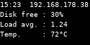

# Raspi OLED

Dieses Projekt dient als Fallstudie für ein Raspberry Pi-Projekt und demonstriert die Umsetzung einer vollständigen Applikation. Die Applikation muss folgende Anforderungen erfüllen:

| ID   | Anforderung                                                            |
|------|:-----------------------------------------------------------------------|
| A1.1 | Die Anwendung muss vollständig in Python geschrieben sein.             |
| A1.2 | Das Display muss Systeminformationen anzeigen:                         |
|      | - Uhrzeit                                                              |
|      | - IP-Adresse                                                           |
|      | - CPU-Auslastung (Load Average der letzten 60 Sekunden)                |
|      | - Verfügbarer Speicherplatz auf der Festplatte                         |
|      | - CPU-Temperatur                                                       |
| A1.3 | Entwicklung der Anwendung muss auch ohne echte Hardware möglich sein. |
| A1.4 | Die Anwendung muss beim Start des Raspberry Pi automatisch starten.    |
| A1.5 | Der Installationsprozess muss automatisiert werden.                    |

Wie aus den Anforderungen ersichtlich, ist die Anzeige von Systeminformationen auf einem Display die Hauptfunktionalität. Eine realitätsnahe Applikation benötigt jedoch über die Grundfunktionalität hinaus nichtfunktionale Anforderungen wie einfache Installation oder die Möglichkeit, die Anwendung lokal (ohne echte Hardware) zu entwickeln, um die Entwicklungszeit zu verkürzen.

## Implementierung

Die Implementierung orientiert sich an den Anforderungen aus der Anforderungstabelle. Jedes Unterkapitel behandelt eine Anforderung und beschreibt deren Umsetzung.

### A1.1 - Die Anwendung muss vollständig in Python geschrieben sein.

Die Anwendung wurde vollständig in Python entwickelt. Da das System von mehreren Drittanbieterbibliotheken abhängt, wurde `pipenv` für die Verwaltung der Abhängigkeiten verwendet. Dies ermöglicht die Installation der Anwendung in einer virtuellen Umgebung, ohne das Betriebssystem des Entwickler-Rechners mit Raspberry-spezifischen Paketen zu belasten. Die Installation der Abhängigkeiten erfolgt aus dem Projektverzeichnis mit dem Befehl:

```shell
pipenv install
```

Nach der Installation stellt die Anwendung eine CLI (Command Line Interface) zur Verfügung, die verschiedene Kommandos für Installation, Wartung und Tests bietet. Eine vollständige Liste der Befehle sowie entsprechende Hilfe kann mit dem folgenden Befehl angezeigt werden:

```shell
pipenv run python main.py --help
```

### A1.2 - Display muss System-Informationen anzeigen.

Für die Anzeige wurde ein 128x64 Pixel OLED-Display verwendet. Die Kommunikation mit dem Display erfolgt über die I2C-Schnittstelle, die von der luma.oled-Bibliothek angesteuert wird. Detaillierte Informationen zu den Anschlüssen und der Bibliothek sind in der [Luma-Dokumentation](https://luma-oled.readthedocs.io/en/latest/) zu finden.

Die Ausgabe ist auf dem folgenden Bild zu sehen:



### A1.3 - Es muss möglich sein, die Anwendung ohne echte Hardware zu entwickeln.

Um die Anwendung ohne echte Hardware zu entwickeln, wurde die `--emulate`-Flag eingeführt. Dadurch ist es möglich, die Ausgabe des Displays in eine Bilddatei zu speichern. So kann die Anwendung ohne Raspberry Pi entwickelt und anschließend auf dem Raspberry Pi deployed werden.

Die Emulation wird mit folgendem Befehl gestartet:

```shell
pipenv run python main.py --watch --emulate
```

### A1.4 - Die Anwendung muss beim Start des Raspberry Pi automatisch starten.

Es ist wichtig, dass bei einer Monitoring-Anwendung nach jedem Systemstart die Hardwarekomponenten automatisch gestartet werden. Unter der Annahme, dass der Raspberry Pi ein Debian-basiertes Betriebssystem verwendet, gibt es mehrere Möglichkeiten, die Anwendung automatisch zu starten. Eine Möglichkeit ist die Verwendung von `systemd`-Units. Dies erleichtert im Vergleich zu `cron.d` die Fehleranalyse mittels `journalctl, wenn die Anwendung im Hintergrund abstürzt oder nicht startet.

### A1.5 - Der Installationsprozess muss automatisiert werden.

Um eine Anwendung produktiv einzusetzen, sind oft systemspezifische Anpassungen notwendig. In diesemFall währe es notwendig, einen systemd-Service zu erstellen und zu aktivieren, was jedoch von der Umgebung, wie dem Pfad zur Python-Installation oder dem Anwendungspfad, abhängig ist. Zur Vereinfachung wurde ein CLI-Befehl bereitgestellt, der die Installation und Aktivierung des systemd-Services automatisiert:

```shell
pipenv run sudo -E env PATH=$PATH python main.py --install
```

Die Deinstallation und Deaktivierung des systemd-Services erfolgt mit:

```shell
pipenv run sudo -E env PATH=$PATH python main.py --uninstall
```

Es ist ebenfalls wichtig zu betonen, dass die Installation von Services mit Root-Rechten erfolgen muss. Durch den Einsatz von pipenv run sudo -E env PATH=$PATH wird das Pipenv-Umfeld an den Installer übergeben, sodass dieser erkennt, wo sich das Pipenv-Umfeld befindet und es an den Hintergrundprozess weiterleiten kann.

## Zusammenfassung

In diesem Projekt wird demonstriert, wie eine umfassende Anwendung für ein Raspberry Pi entwickelt wird, die wichtige Systeminformationen auf einem OLED-Display anzeigt. Dabei wird großer Wert auf eine vollständige Implementierung in Python, einfache Installation, und die Möglichkeit zur Entwicklung ohne physische Hardware gelegt. Die Anwendung unterstützt zudem den Autostart bei Systemstart und bietet eine CLI für einfache Handhabung. Die Dokumentation hebt hervor, dass neben der Bereitstellung der Hauptfunktionalität, nicht-funktionale Anforderungen wesentlich sind, um die Anwendung praxistauglich zu machen.
